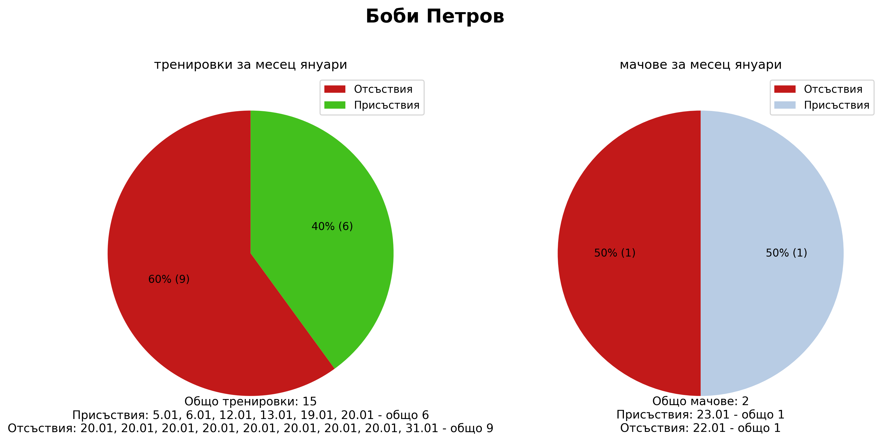
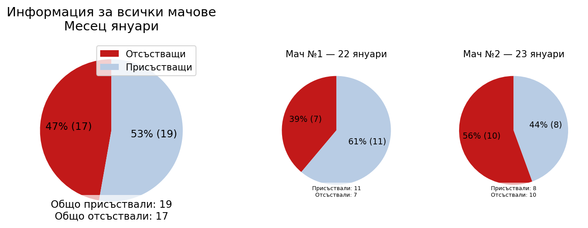
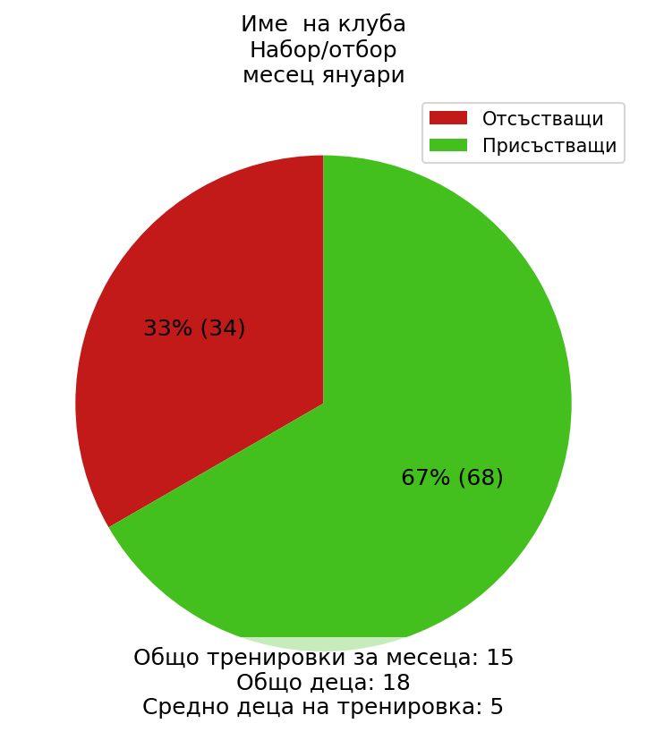
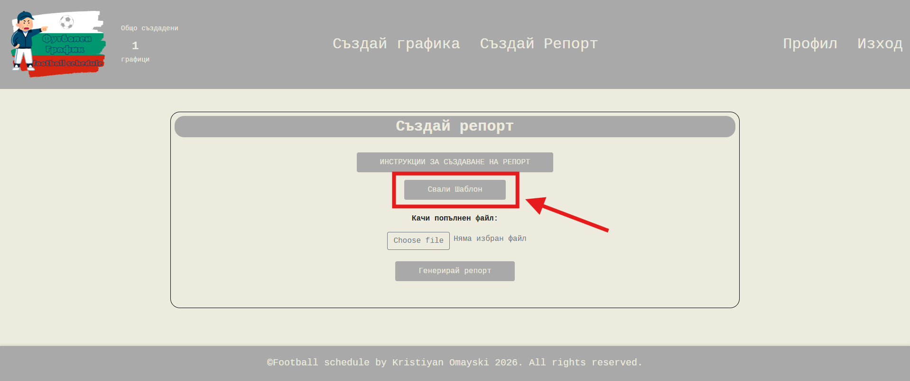
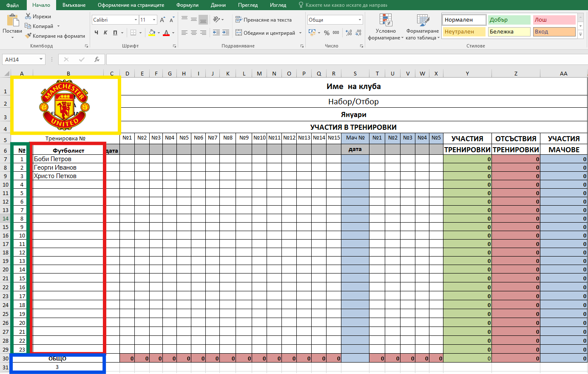
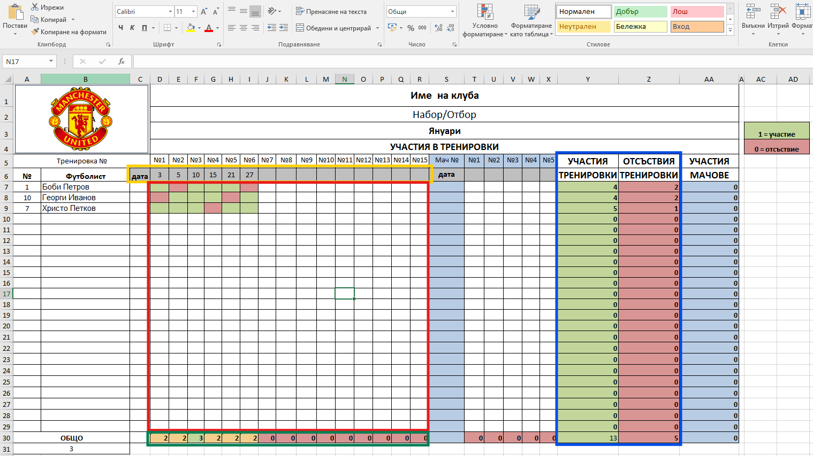
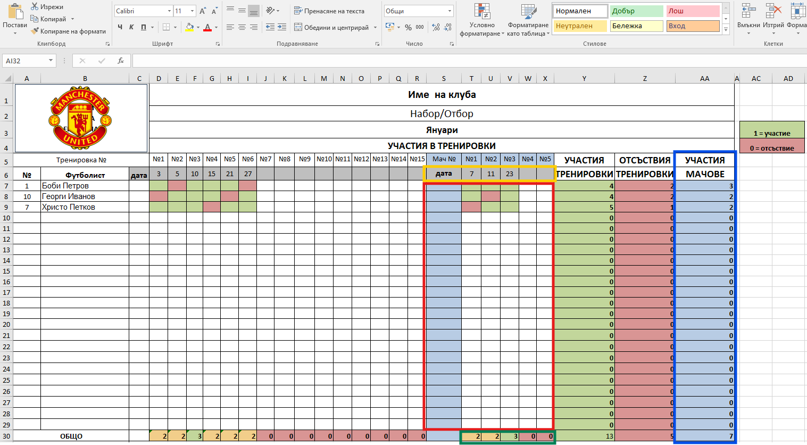
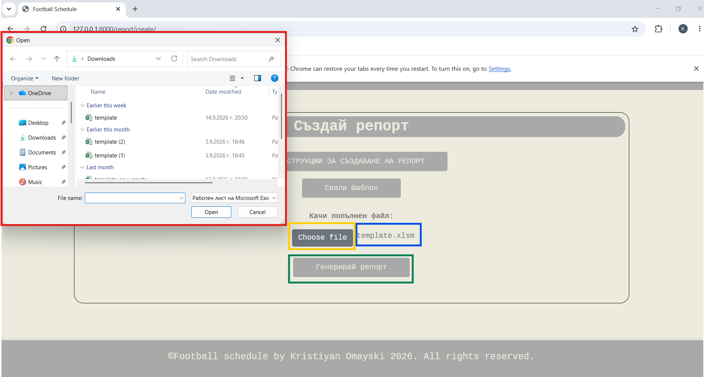
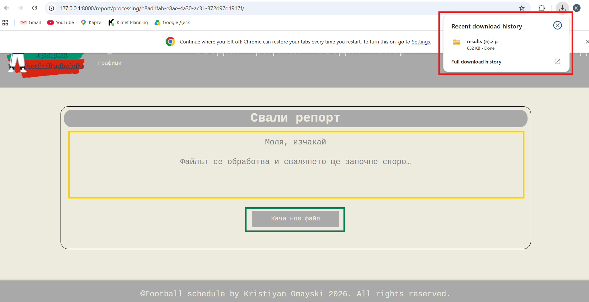

# Инструкции за създаване на репорт

С тази функционалност можете да генерирате месечни репорти за посещаемостта на тренировките и мачовете. Резултатите включват обобщена информация за отбора и индивидуална статистика за всеки футболист, представени графично.

## Каква информация съдържа репортът

### Тренировки

- Брой тренировки за месеца
- Брой футболисти, участвали в тренировките през месеца
- Средна посещаемост на тренировка — средният брой присъствали футболисти
- Общ брой и процент на присъствията и отсъствията

### Мачове

- Брой мачове за месеца
- Брой футболисти, участвали в мачове през месеца
- Общ брой и процент на присъствията и отсъствията

### Индивидуално представяне

За всеки футболист репортът показва:

- Брой присъствия и отсъствия от тренировки
- Графика и процентно съотношение на присъствията и отсъствията от тренировки
- Дати на присъствие и отсъствие от тренировки
- Брой присъствия и отсъствия от мачове
- Графика и процентно съотношение на присъствията и отсъствията от мачове
- Дати на присъствие и отсъствие от мачове

## 1. Сваляне на шаблона

1. Отворете страницата за генериране на репорт.
2. Натиснете бутона **„Свали Шаблон“**.
3. След изтеглянето намерете Excel файла в папката за изтегляния на браузъра.
4. Отворете файла и попълнете заглавната информация за отбора.
5. Добавете емблемата на клуба и я позиционирайте и оразмерете на подходящото място.

## 2. Попълване на играчите

В шаблона можете да добавите до 23 футболисти.

- В колоната **„Футболист“** въведете имената на футболистите.
- В колоната **„№“** въведете номерата на фланелките. Ако не използвате номера, оставете подредбата по подразбиране от 1 до 23.
- Под списъка на футболистите редът **„Общо“** показва броя на добавените футболисти.

## 3. Попълване на тренировките

За всяка тренировка попълнете датата и данните за присъствие:

- В сивия ред след **„дата“** въведете датите на тренировките за съответния месец. Въведете само деня; месецът се определя автоматично при генериране на репорта.
- За всеки футболист въведете **1** за присъствие и **0** за отсъствие.
- Шаблонът оцветява автоматично клетките според присъствието или отсъствието.
- Редът под данните показва общия брой присъствали футболисти за съответната тренировка.
- Колоните **„Участия“** и **„Отсъствия“** показват общия брой присъствия и отсъствия за всеки футболист.

## 4. Попълване на мачовете

За всеки мач попълнете датата и данните за участието на футболистите:

- В синия ред след **„дата“** въведете датите на мачовете за съответния месец. Въведете само деня; месецът се определя автоматично при генериране на репорта.
- За всеки футболист въведете **1** за присъствие и **0** за отсъствие.
- Шаблонът оцветява автоматично клетките според присъствието или отсъствието.
- Редът под данните показва общия брой присъствали футболисти за съответния мач.
- Колоната **„Участия Мачове“** показва общия брой участия и отсъствия на футболиста.

## 5. Генериране и изтегляне на репорта

1. В секцията **„Качи попълнен файл:“** натиснете **„Choose File“**.
2. Намерете и изберете попълнения Excel шаблон.
3. Проверете дали името на избрания файл се показва до бутона **„Choose File“**.
4. Натиснете **„Генерирай репорт“**.
5. Ще бъдете пренасочени към страница за обработка. Съобщението **„Файлът се обработва и свалянето ще започне скоро“** означава, че репортът се генерира.
6. След приключване на обработката ZIP файлът с резултатите започва да се изтегля автоматично.
7. За да създадете друг репорт, натиснете **„Генерирай нов репорт“**.

## Обобщение на обработката

Попълненият Excel шаблон съдържа данни за отбора, играчите, датите и посещаемостта. След качване системата обработва данните и генерира месечни обобщения и индивидуални графични репорти. Резултатите се предоставят на потребителя като ZIP архив.
